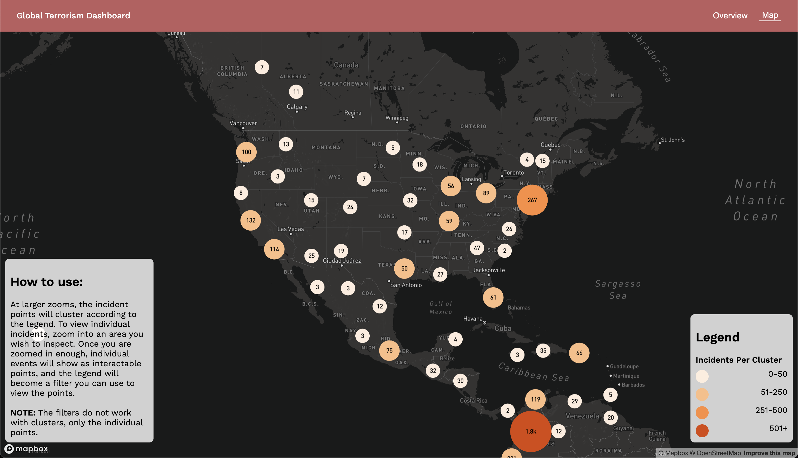

# Terrorism Mapping Project

By Harrison Liao, Joohoon Cha, Keith Ellingwood, Wesley Nguyen, and Steven Chen

### Project Description

This project was created in order to show a visualization of global terrorist activities and inform users about the patterns and exact information of these activities. To facilitate this, we created a map that utilizes both clustering for a quick introduction to the data at higher zooms, but switch to a legend filter at lower zooms for those looking for more details. All of this will help our audience to visualize, understand, and demonstrate different trends and aspects of global terrorism, hopefully leading to a better understanding of terrorism attacks and perhaps how to prevent them for good.

### Project Goals

The goal of our project is to provide a better understanding of terrorism acts and the consequences of them, which aims to help the prevention of future terrorism acts.  Since the project is accessible to the whole public, there could be other unintended impacts that come along with it.  One instance would be enforcing stereotypes of certain areas due to its political instability, even though events could be largely local and have no relation to the demographics the user interacts with.  Another would be people with ill intentions trying to replicate the attacks mentioned, although we perceive this risk as very low because there are other materials that are much more influential that incites the user to do such actions.

### Data Sources

The data source used comes from the [Global Terrorism Database](https://www.start.umd.edu/gtd/) (GTD), created and maintained by the National Consortium for the Study of Terrorism and Responses to Terrorism (START), a federally sponsored research team from the University of Maryland. This database contains over 200,000 individual entries of terrorism acts that have happened globally from 1970 to 2019, along with many different details of each individual happening. It also includes the latitude and longitude of every event meaning it is able to be easily mapped.

### Attributions

We used ArcGIS Pro to convert the csv from the data source into geojson. In order to clean the data, we used a Jupyter Notebook and basic operations within Excel. We used the mapping library Mapbox JS fo r the map.

Thank you to Professor Zhao and the TAs Jiaxin Feng and Steven Bao, as well as the University of Washington.
